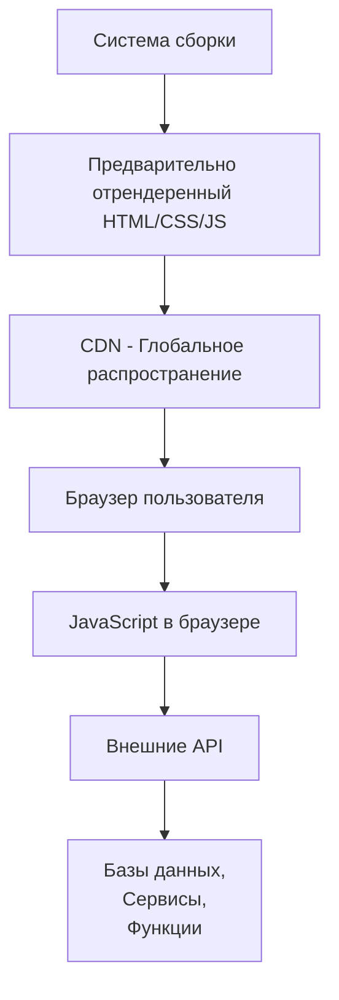
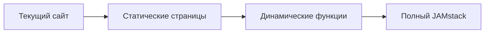

# JAMstack: Революция в веб-разработке

JAMstack — это современная архитектура веб-разработки, которая emphasizes предварительный рендеринг и отсоединение фронтенда от бэкенда. Название расшифровывается как **JavaScript**, **API** и **Markup**.

## Что такое JAMstack?

### Основная концепция

JAMstack — это не конкретная технология, а архитектурный подход:

- **J**avaScript — динамическая логика на стороне клиента
- **A**PI — серверные процессы через JavaScript API
- **M**arkup — предварительно собранные шаблоны



### Чем JAMstack НЕ является

- ❌ Это не конкретный фреймворк
- ❌ Это не CMS система
- ❌ Это не только для статических сайтов
- ❌ Это не означает "без бэкенда"

---

## Ключевые принципы JAMstack

### 1. Предварительный рендеринг (Pre-rendering)
Весь сайт собирается во время сборки, а не при каждом запросе.

### 2. Отсоединение фронтенда от бэкенда
Фронтенд развертывается отдельно, взаимодействует с бэкендом через API.

### 3. Глобальное распространение через CDN
Статические файлы доставляются через сеть доставки контента.

---

## Преимущества JAMstack

### ⚡ Производительность
```javascript
// Традиционный подход - рендеринг на сервере при каждом запросе
app.get('/page', (req, res) => {
    const data = fetchFromDatabase();
    const html = renderTemplate(data); // Медленно при каждом запросе
    res.send(html);
});

// JAMstack - предварительный рендеринг
// Во время сборки: renderAllPages() -> готовые HTML файлы
// При запросе: serveStaticFile() -> мгновенная загрузка
```

**Результат**: Время загрузки 100-500ms вместо 1-3 секунд

### 🔒 Безопасность
```javascript
// Меньше поверхностей атаки
TRADITIONAL: [Сервер БД, Сервер приложений, Веб-сервер] -> Уязвимости везде
JAMSTACK: [CDN + Статические файлы] -> Минимальная поверхность атаки
```

### 📈 Масштабируемость
```bash
# Традиционный сервер
$ ab -n 10000 -c 100 http://traditional-site.com
# Результат: 500 ошибок, медленные ответы

# JAMstack на CDN
$ ab -n 10000 -c 100 http://jamstack-site.com
# Результат: 0 ошибок, одинаково быстрые ответы
```

### 🛠 Простота разработки
```yaml
# Традиционный стек:
- Сервер БД
- Бэкенд фреймворк
- Веб-сервер
- Кэширование
- Балансировщик нагрузки

# JAMstack:
- Git репозиторий
- Система сборки
- CDN хостинг
```

### 💰 Экономическая эффективность
```javascript
// Сравнение стоимости (условные единицы)
const traditionalCost = {
    hosting: 50,
    cdn: 20,
    maintenance: 100,
    scaling: 200  // При пиковой нагрузке
};

const jamstackCost = {
    hosting: 0,    // GitHub Pages, Netlify, Vercel
    cdn: 10,       // Включено в хостинг
    maintenance: 10,
    scaling: 10    // Автоматическое масштабирование
};
```

---

## Инструменты JAMstack

### Генераторы статических сайтов

#### 1. Next.js
```javascript
// pages/blog/[slug].js - Статическая генерация с данными
export async function getStaticPaths() {
    const posts = await fetch('https://api.example.com/posts');
    const paths = posts.map(post => ({
        params: { slug: post.slug }
    }));

    return { paths, fallback: false };
}

export async function getStaticProps({ params }) {
    const post = await fetch(`https://api.example.com/posts/${params.slug}`);
    return { props: { post } };
}

export default function BlogPost({ post }) {
    return (
        <article>
            <h1>{post.title}</h1>
            <div dangerouslySetInnerHTML={{ __html: post.content }} />
        </article>
    );
}
```

#### 2. Gatsby
```javascript
// gatsby-node.js - Создание страниц из данных
exports.createPages = async ({ actions, graphql }) => {
    const { data } = await graphql(`
        query {
            allContentfulBlogPost {
                nodes {
                    slug
                    title
                    content
                }
            }
        }
    `);

    data.allContentfulBlogPost.nodes.forEach(node => {
        actions.createPage({
            path: `/blog/${node.slug}`,
            component: require.resolve('./src/templates/blog-post.js'),
            context: { slug: node.slug }
        });
    });
};
```

#### 3. Hugo (который вы используете)
```go
// layouts/_default/list.html - Шаблон списка
{{ define "main" }}
<section class="posts">
    {{ range .Pages }}
    <article class="post">
        <h2><a href="{{ .Permalink }}">{{ .Title }}</a></h2>
        <time>{{ .Date.Format "January 2, 2006" }}</time>
        <p>{{ .Summary }}</p>
    </article>
    {{ end }}
</section>
{{ end }}
```

#### 4. Nuxt.js
```javascript
// nuxt.config.js
export default {
    target: 'static',
    generate: {
        routes: async () => {
            const posts = await $fetch('https://api.example.com/posts');
            return posts.map(post => `/blog/${post.slug}`);
        }
    }
};
```

#### 5. Eleventy (11ty)
```javascript
// .eleventy.js
module.exports = function(eleventyConfig) {
    eleventyConfig.addCollection("posts", function(collection) {
        return collection.getFilteredByGlob("src/posts/*.md");
    });

    return {
        dir: {
            input: "src",
            output: "dist"
        }
    };
};
```

### Хостинг платформы

#### 1. Vercel (для Next.js)
```json
// vercel.json
{
  "version": 2,
  "builds": [
    {
      "src": "package.json",
      "use": "@vercel/static-build"
    }
  ],
  "routes": [
    {
      "src": "/(.*)",
      "dest": "/index.html"
    }
  ]
}
```

#### 2. Netlify
```toml
# netlify.toml
[build]
  publish = "dist"
  command = "npm run build"

[build.environment]
  NODE_VERSION = "18"

[[redirects]]
  from = "/*"
  to = "/index.html"
  status = 200
```

#### 3. GitHub Pages
```yaml
# .github/workflows/deploy.yml
name: Deploy to GitHub Pages
on:
  push:
    branches: [ main ]
jobs:
  deploy:
    runs-on: ubuntu-latest
    steps:
      - uses: actions/checkout@v3
      - uses: actions/setup-node@v3
        with:
          node-version: 18
      - run: npm install
      - run: npm run build
      - uses: peaceiris/actions-gh-pages@v3
        with:
          github_token: ${{ secrets.GITHUB_TOKEN }}
          publish_dir: ./dist
```

### Headless CMS системы

#### 1. Contentful
```javascript
// Использование в компоненте
import { createClient } from 'contentful';

const client = createClient({
    space: process.env.CONTENTFUL_SPACE_ID,
    accessToken: process.env.CONTENTFUL_ACCESS_TOKEN
});

export async function getStaticProps() {
    const entries = await client.getEntries({
        content_type: 'blogPost'
    });

    return {
        props: { posts: entries.items }
    };
}
```

#### 2. Strapi
```javascript
// API вызов к Strapi
async function getProducts() {
    const response = await fetch('https://api.example.com/products', {
        headers: {
            'Authorization': `Bearer ${process.env.STRAPI_TOKEN}`
        }
    });
    return response.json();
}
```

#### 3. Sanity
```javascript
// sanity.config.js
export default defineConfig({
    name: 'default',
    title: 'My Blog',
    projectId: 'your-project-id',
    dataset: 'production',
    plugins: [deskTool(), visionTool()],
    schema: {
        types: schemaTypes,
    }
});
```

### Serverless Functions

#### AWS Lambda через Netlify
```javascript
// netlify/functions/contact-form.js
exports.handler = async (event) => {
    if (event.httpMethod !== 'POST') {
        return { statusCode: 405, body: 'Method Not Allowed' };
    }

    const { name, email, message } = JSON.parse(event.body);

    // Отправка email через SendGrid
    await sendEmail({ name, email, message });

    return {
        statusCode: 200,
        body: JSON.stringify({ message: 'Email sent successfully' })
    };
};
```

#### Vercel Serverless Functions
```javascript
// api/contact.js
export default async function handler(req, res) {
    if (req.method === 'POST') {
        const { name, email } = req.body;

        // Сохранение в базе данных
        await saveToDatabase({ name, email });

        res.status(200).json({ success: true });
    } else {
        res.status(405).json({ error: 'Method not allowed' });
    }
}
```

---

## Примеры реализации

### 1. Корпоративный сайт
```javascript
// Структура проекта
corporate-site/
├── components/
│   ├── Header.js
│   ├── Footer.js
│   └── ContactForm.js
├── pages/
│   ├── index.js
│   ├── about.js
│   ├── services.js
│   └── contact.js
├── lib/
│   └── api.js
└── public/
    ├── images/
    └── favicon.ico

// Конфигурация Next.js
// next.config.js
module.exports = {
    images: {
        domains: ['images.ctfassets.net'], // Contentful CDN
    },
    env: {
        CONTENTFUL_SPACE_ID: process.env.CONTENTFUL_SPACE_ID,
        CONTENTFUL_ACCESS_TOKEN: process.env.CONTENTFUL_ACCESS_TOKEN,
    }
};
```

### 2. E-commerce магазин
```javascript
// Продуктовая страница
// pages/products/[slug].js
export async function getStaticPaths() {
    const products = await commerce.products.list();
    const paths = products.data.map(product => ({
        params: { slug: product.permalink }
    }));

    return { paths, fallback: false };
}

export async function getStaticProps({ params }) {
    const product = await commerce.products.retrieve(params.slug, {
        type: 'permalink'
    });

    return { props: { product } };
}

export default function ProductPage({ product }) {
    const [cart, setCart] = useCart();

    const addToCart = () => {
        commerce.cart.add(product.id, 1).then(setCart);
    };

    return (
        <div>
            <h1>{product.name}</h1>
            <p>{product.price.formatted_with_symbol}</p>
            <button onClick={addToCart}>Add to Cart</button>
        </div>
    );
}
```

### 3. Блог с комментариями
```javascript
// Компонент комментариев
// components/Comments.js
import { useState, useEffect } from 'react';

export default function Comments({ postId }) {
    const [comments, setComments] = useState([]);
    const [newComment, setNewComment] = useState('');

    useEffect(() => {
        fetch(`/api/comments?postId=${postId}`)
            .then(res => res.json())
            .then(setComments);
    }, [postId]);

    const submitComment = async () => {
        const response = await fetch('/api/comments', {
            method: 'POST',
            headers: { 'Content-Type': 'application/json' },
            body: JSON.stringify({ postId, text: newComment })
        });

        if (response.ok) {
            const comment = await response.json();
            setComments([...comments, comment]);
            setNewComment('');
        }
    };

    return (
        <div>
            <h3>Comments ({comments.length})</h3>
            {comments.map(comment => (
                <div key={comment.id}>
                    <strong>{comment.author}</strong>
                    <p>{comment.text}</p>
                </div>
            ))}
            <textarea
                value={newComment}
                onChange={e => setNewComment(e.target.value)}
            />
            <button onClick={submitComment}>Add Comment</button>
        </div>
    );
}
```

### 4. Документация проекта
```yaml
# Структура для документации
docs/
├── src/
│   ├── content/
│   │   ├── getting-started.md
│   │   ├── api-reference.md
│   │   └── guides/
│   ├── components/
│   └── layouts/
├── public/
└── package.json

# Конфигурация Docusaurus (пример)
# docusaurus.config.js
module.exports = {
    title: 'My Project Docs',
    themeConfig: {
        navbar: {
            items: [
                { to: 'docs/getting-started', label: 'Docs' },
                { to: 'blog', label: 'Blog' }
            ]
        }
    },
    presets: [
        [
            '@docusaurus/preset-classic',
            {
                docs: {
                    routeBasePath: '/',
                    path: 'src/content'
                }
            }
        ]
    ]
};
```

---

## Когда выбирать JAMstack?

### ✅ Идеальные сценарии

- **Маркетинговые сайты** и лендинги
- **Блоги** и документация
- **Портфолио** и персональные сайты
- **E-commerce** с статическим каталогом
- **Корпоративные сайты** с редкими обновлениями

### ⚠️ Требует осторожности

- **Высокоинтерактивные приложения** (социальные сети)
- **Реальное время** (чаты, уведомления)
- **Сложные пользовательские сессии**
- **Часто меняющийся контент**

### 🔄 Гибридный подход

```javascript
// Комбинирование статического и динамического
// pages/dashboard.js
export async function getServerSideProps(context) {
    // Динамический рендеринг для защищенных страниц
    const session = await getSession(context);

    if (!session) {
        return { redirect: { destination: '/login' } };
    }

    const userData = await fetchUserData(session.user.id);

    return { props: { userData } };
}

export default function Dashboard({ userData }) {
    // Клиентские взаимодействия через API
    return (
        <div>
            <StaticHeader /> {/* Статическая часть */}
            <DynamicUserData data={userData} /> {/* Динамическая часть */}
        </div>
    );
}
```

---

## Миграция на JAMstack

### Пошаговый процесс

1. **Анализ текущего стека**
```javascript
const currentStack = {
    database: 'MySQL',
    backend: 'PHP/Laravel',
    frontend: 'jQuery',
    hosting: 'Shared hosting'
};
```

2. **Выбор инструментов**
```javascript
const jamstackStack = {
    cms: 'Contentful/Strapi',
    generator: 'Next.js/Gatsby',
    hosting: 'Vercel/Netlify',
    functions: 'AWS Lambda/Vercel Functions'
};
```

3. **Поэтапная миграция**


### Инструменты миграции

- **WordPress → JAMstack**: WP2Static, Simply Static
- **Drupal → JAMstack**: Gatsby Source Drupal
- **Custom CMS → JAMstack**: Создание API эндпоинтов

---

## Будущее JAMstack

### Тренды 2024-2025

1. **Edge Computing** - выполнение кода ближе к пользователю
2. **Islands Architecture** - гидрация только интерактивных частей
3. **WebAssembly** - высокая производительность в браузере
4. **AI-generated Content** - динамический контент через AI API

### Пример Edge Functions
```javascript
// middleware.js - Edge Middleware в Next.js
import { NextResponse } from 'next/server';

export function middleware(request) {
    // Персонализация на edge
    const country = request.geo.country;
    const response = NextResponse.next();

    if (country === 'RU') {
        response.cookies.set('region', 'russia');
    }

    return response;
}
```

## Заключение

JAMstack — это не временный тренд, а фундаментальный сдвиг в веб-разработке. Он предлагает:

- 🚀 **Невероятную производительность**
- 🔒 **Встроенную безопасность**
- 📈 **Автоматическое масштабирование**
- 💰 **Снижение затрат**
- 🛠 **Упрощенный workflow разработки**

Для большинства веб-проектов JAMstack предоставляет оптимальное сочетание производительности, безопасности и стоимости. Начинайте с простых проектов и постепенно осваивайте более сложные сценарии.

---

*Готовы начать? Изучите наши практические руководства по [Next.js](/tags/nextjs) и [Headless CMS](/tags/headless-cms) для быстрого старта с JAMstack.*
